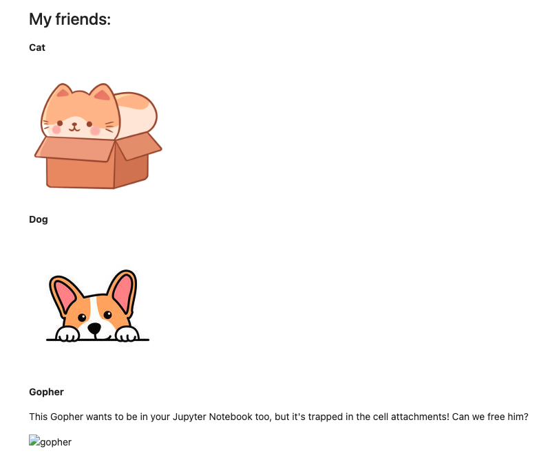

# goldmark-jupyter

From `nbformat` documentation:

```txt
Markdown (and raw) cells can have a number of attachments, typically inline images, that can be referenced in the markdown content of a cell. 🖇

(punctuation mine)
```

`goldmark-jupyter` helps [`goldmark`](https://github.com/yuin/goldmark) recognise [cell attachments](https://nbformat.readthedocs.io/en/latest/format_description.html#cell-attachments) and include them in the rendered markdown correctly.


| `goldmark`  | `goldmark-jupyter` |
| ----------- | ----------- |
|  |        |

## Installation

```sh
go get github.com/bevzzz/nb/extensions/extra/goldmark-jupyter
```

## Usage

Package `goldmark-jupyter` exports 2 dedicated extensions for `goldmark` and `nb`, which should be used together like so:

```go
import (
	"github.com/bevzzz/nb"
	"github.com/bevzzz/nb/extensions/extra/goldmark-jupyter"
	"github.com/yuin/goldmark"
)

md := goldmark.New(
	goldmark.WithExtensions(
		jupyter.Attachments(),
	),
)

c := nb.New(
	nb.WithExtensions(
		jupyter.Goldmark(md),
	),
)

if err := c.Convert(io.Stdout, b); err != nil {
	panic(err)
}
```

`Attachments` will extend the default `goldmark.Markdown` with a custom link parser and an image renderer. Quite naturally, this renderer accepts `html.Options` which can be passed to the constructor:

```go
import (
	"github.com/bevzzz/nb/extensions/extra/goldmark-jupyter"
	"github.com/yuin/goldmark"
	"github.com/yuin/goldmark/render/html"
)

md := goldmark.New(
	goldmark.WithExtensions(
		jupyter.Attachments(
			html.WithXHTML(),
			html.WithUnsafe(),
		),
	),
)
```

Note, however, that options not applicable to image rendering will have no effect. As of the day of writing, `goldmark v1.6.0` references these options when rendering images:

- `WithXHML()`
- `WithUnsafe()`
- `WithWriter(w)`

## Contributing

Thank you for giving `goldmark-jupyter` a run!  

If you find a bug that needs fixing or a feature that needs adding, please consider describing it in an issue or opening a PR.

## License

This software is released under [the MIT License](https://opensource.org/license/mit/).
